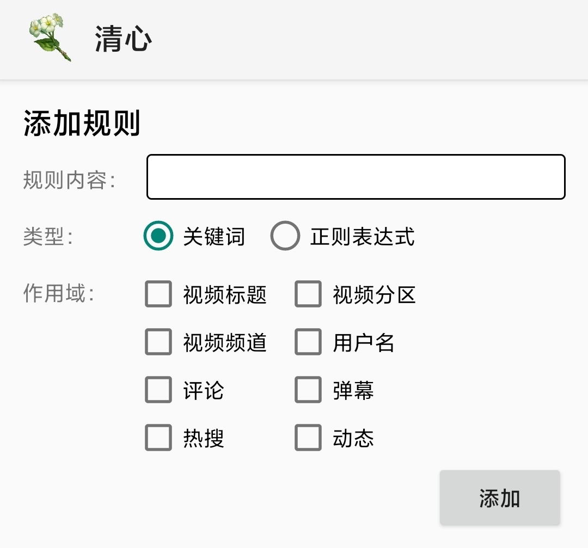
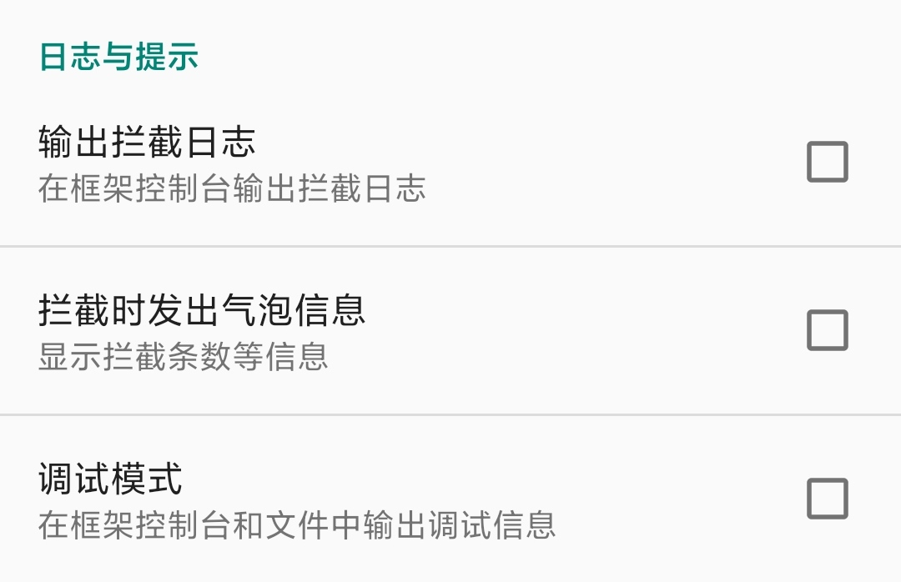

# 清心

## 简介
[清心](https://bbs.mihoyo.com/ys/obc/content/751/detail?bbs_presentation_style=no_header)是一款为bilibili app增加内容屏蔽功能的Xposed模块，它能够根据关键词或正则表达式，来屏蔽不想看到的评论、弹幕、首页推荐等内容。

本项目完全开源，遵循Apache-2.0 License，您可以检查它的行为，或基于它进行二次开发。

## 使用
您可以[点击此处](https://github.com/kosaka-bun/Qingxin/releases/latest)下载最新版本的清心模块。

使用之前，您需要了解与Xposed框架有关的前置知识，了解如何使用Xposed模块。

如果您的设备未获取root权限，您可以借助“应用转生”来使app能够在未root的环境下使用清心模块。

如果已获取root权限，且已安装如[LSPosed](https://github.com/LSPosed/LSPosed)等Xposed框架的实现，您可以直接在安装清心模块后启动它。

## 权限
清心需要使用以下权限：
- 自启动权限。用于在app运行时使app能够读取到清心的基本配置，以及所添加的过滤规则。
- 文件读取权限。用于读取包含过滤规则的文件，以导入配置（仅在执行规则导入操作时会请求此权限）。

## 规则
清心依赖用户添加的规则来实现个性化的内容过滤，此部分内容将讲述如何正确添加一条规则。

如上图所示，清心的规则有8个作用域，分别是“视频标题”、“视频分区”、“视频频道”、“用户名”、“评论”、“弹幕”、“热搜”和“动态”。

以评论过滤为例，假如您希望app不显示任何内容包含`java`这一关键词的评论，您只需要：
- 在“规则内容”中填入`java`。
- 选中“评论”作用域。
- 添加规则。

上面是一个最简单的例子，它表示过滤掉所有包含`java`这一关键词的评论，如果某条评论的内容包含`java`关键词，那么将不会被展示。如果您想要更灵活的过滤规则，可以选择多个作用域，以及结合正则表达式来使用。

在上面的例子中，如果您选择了“正则表达式”类型，那么只要**某条评论**的**某个部分**匹配所填入的正则表达式（不区分大小写），那条评论就不会被展示。

其他作用域的过滤逻辑与此类似。

“用户名”这一作用域是一个特例，如果某条规则的作用域包含“用户名”，那么：
- 首页推荐视频的发布者的用户名若符合这条规则，此推荐视频不会被展示。
- 评论的发布者的用户名若符合这条规则，此评论将不会被展示。
- 动态的发布者的用户名拖符合这条规则，此动态将不会被展示。

## 日志

您可以在清心首页的配置中启用“输出拦截日志”或“拦截时发出气泡信息”，来验证添加的规则是否生效。

## 倡议
当今互联网从不缺乏优质的内容，我们能从中收获很多东西，但若是很多糟糕的东西和它们混在一起，那么浏览体验就降低很多了。并不是所有应用都具有内容过滤功能，具有此功能的应用也不是所有内容都能够过滤。

如果我们能够按自己的需求，过滤掉大部分糟糕的内容，使自己得到的推荐大多是优质内容，则我们的浏览体验一定可以得到提升，或许社区氛围也会因此变得好一些。

所以，如果您是一名开发者，希望您能参与到各类基于用户规则的内容过滤功能的开发中（不仅限于bilibili app），为提升自己与他人的浏览体验而做出贡献。